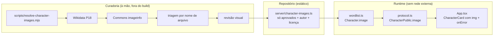

# Fotos dos Personagens — Design

**Spec**: `.specs/features/fotos-personagens/spec.md`
**Status**: Draft

---

## Architecture Overview

Duas metades separadas por um artefato humano. Um script de curadoria roda **à mão**, fora do build, e produz candidatos com metadados. A revisão aprova ou rejeita. O aprovado vira um módulo TypeScript versionado, e a partir daí é dado estático como qualquer outro do catálogo.



A fronteira importa: nada em `server/` ou `src/` fala com a Wikimedia. O script vive em `scripts/`, não é importado por nada e não entra no build.

---

## Abordagens consideradas

### Onde mora a lista de imagens

| Abordagem | Trade-off |
| --------- | --------- |
| **A. `server/character-images.ts`, curado à mão** ✅ **recomendada** | Fonte da verdade humana, igual ao catálogo de nomes (AD-001). Diff legível, revisável em PR, e um rename de personagem quebra o teste em vez de sumir. |
| B. Campo `image` direto em `characterSets` | O arquivo já tem 300+ nomes em strings com `\|`; enfiar URL e autor ali tornaria a linha ilegível. |
| C. JSON gerado pelo script, consumido sem revisão | Rápido, mas entrega grafite do Vegeta e Pernalonga em caça direto no jogo. A medição mostrou que revisão não é opcional. |

### Como revisar 304 candidatos

| Abordagem | Trade-off |
| --------- | --------- |
| **A. Triagem por nome/categoria, depois revisão visual das sobreviventes** ✅ **recomendada** | O nome do arquivo já denuncia os piores (`FB-111 Bugs Bunny Nose Art`, `Bushwick Brooklyn Art`), então a triagem barata elimina a maioria dos ruins. Só o resto exige olhar. |
| B. Revisão visual de todos | Custo alto sem ganho: nome de arquivo com `Nose Art` não precisa de inspeção. |
| C. Só triagem automática | Deixa passar o ambíguo — "NYCC 2018 pics 27.jpg" não diz se é um cosplay bom ou ruim. |

**Limite honesto:** a triagem automática eu faço; a revisão visual exige de fato **olhar** cada imagem. Isso vai para subagentes dedicados, que abrem as imagens e julgam "um brasileiro reconhece isto?" — e o veredito final ambíguo fica com o usuário, num contact sheet HTML.

---

## Code Reuse Analysis

| Component | Location | How to Use |
| --------- | -------- | ---------- |
| `normalizeText()` | `server/normalization.ts:1` | Chave do mapa de imagens, igual a `aliasesByName` e `englishOriginals` |
| `englishOriginals` (padrão) | `server/wordlist.ts` | `characterImages` segue a mesma forma: mapa por nome normalizado, fundido na montagem dos seeds |
| Guarda de paridade `totalSeedCount` | `tests/wordlist.test.ts` | Mesmo padrão para pegar entrada de imagem órfã depois de um rename (IMG-04) |
| `viewRoom(room, viewerId)` | `server/game.ts` | A imagem viaja dentro de `CharacterPublic`, então herda a proteção de privacidade existente sem código novo |
| `CharacterCard` | `src/App.tsx` | Ganha `` e `onError`; o visual atual de inicial e cor passa a ser o fallback |
| `character-color-${i % 4}` | `src/styles.css` | Continua sendo o fundo quando não há imagem |

| System | Integration Method |
| ------ | ------------------ |
| Wikimedia | **Só em curadoria.** Em runtime o navegador carrega a URL do `upload.wikimedia.org` como qualquer ``; nenhum código nosso chama API |
| Socket.IO | Campo novo dentro de `CharacterPublic`, que já viaja nos eventos existentes; nenhum emissor muda |

---

## Components

### `scripts/resolve-character-images.mjs` (novo, dev-only)

- **Purpose**: Resolver candidatos e metadados de licença; não roda no build.
- **Interfaces**: `node scripts/resolve-character-images.mjs [--out DIR]` → `candidates.json` + `contact-sheet.html`
- **Dependencies**: Node 22 (`fetch` nativo), rede. `User-Agent` identificando o projeto, como a política da Wikimedia pede.
- **Reuses**: lê os nomes de `server/wordlist.ts` via import do módulo compilado ou parse do arquivo.

### `server/character-images.ts` (novo, curado)

- **Purpose**: Mapa de imagens aprovadas.
- **Interfaces**:
  ```typescript
  export interface CharacterImage {
    url: string        // thumbnail do Commons, ≤320px
    author: string     // exigido; entrada sem autor é rejeitada na curadoria
    license: string    // ex. 'CC BY-SA 2.0', 'Public domain'
  }
  export const characterImages: Record<string, CharacterImage>
  ```
- **Reuses**: forma de `englishOriginals`.

### `server/wordlist.ts` (alterado)

- `Character` ganha `image?: CharacterImage`, preenchido na montagem dos seeds a partir de `characterImages`.

### `shared/protocol.ts` (alterado)

- `CharacterPublic` ganha `image?: CharacterImage` (estrutura espelhada, sem importar código de servidor).

### `src/App.tsx` (alterado)

- `CharacterCard`: `` quando há imagem, com `onError` trocando para o fallback; nome e categoria sempre visíveis; crédito acessível.
- Tela de revelação: crédito das imagens do quadro.

---

## Data Models

```typescript
// shared/protocol.ts
interface CharacterPublic {
  id: string
  name: string
  category: string
  image?: {          // ausente quando não há imagem aprovada
    url: string
    author: string
    license: string
  }
}
```

**Relationships**: `image` é opcional em toda a cadeia. Ausência é o caso comum e o fallback é o visual atual — nenhum consumidor pode assumir presença.

---

## Error Handling Strategy

| Error Scenario | Handling | User Impact |
| -------------- | -------- | ----------- |
| Imagem 404 / bloqueada / offline | `onError` no `` troca para inicial e cor | Card igual ao de hoje, sem espaço vazio |
| Imagem lenta | Nome e categoria renderizam antes; imagem entra depois | Card útil de imediato |
| Proporção diferente da do card | `object-fit: cover` | Recorta sem distorcer |
| Commons sem autor declarado | Rejeitado na curadoria | Personagem fica sem foto |
| Personagem renomeado, entrada órfã | Teste de paridade falha | Quebra no CI, não em produção |

---

## Risks & Concerns

| Concern | Location (file:line) | Impact | Mitigation |
| ------- | -------------------- | ------ | ---------- |
| **Vetor de vazamento novo**: a URL da imagem é mais um dado do personagem que não pode chegar ao próprio jogador | `server/game.ts` (`viewRoom`) | Jogador descobriria a resposta pela foto | A imagem viaja dentro de `CharacterPublic`, que `viewRoom` já omite para o próprio jogador — proteção herdada. Mesmo assim PRIV-02 exige teste explícito com a URL, porque herdar proteção sem testar é como o mutante de POOL-06 sobreviveu |
| Qualidade da imagem é loteria | `server/character-images.ts` | Grafite e estátua de cera confundem em vez de ajudar | Curadoria com triagem + revisão visual; aprovar só o reconhecível, e aceitar cobertura parcial |
| Atribuição é obrigação legal, não enfeite | `src/App.tsx` | CC BY e CC BY-SA exigem crédito | `author` e `license` são campos obrigatórios da estrutura; entrada sem autor é rejeitada na curadoria, e CARD-04 exige exibição |
| Hotlink depende do Commons continuar servindo | runtime | Imagem pode sumir se o arquivo for renomeado ou apagado no Commons | `onError` cai para o fallback; a feature degrada, não quebra. Aceito por decisão explícita de não hospedar assets |
| Script novo em `scripts/` pode ser confundido com código de produção | `scripts/` | Alguém importar no servidor reintroduziria dependência de runtime | Extensão `.mjs`, fora de todo tsconfig, e IMG-05 com teste que varre `server/` e `src/` procurando domínio da Wikimedia |
| Tabela grande de imagens infla o payload de estado | `shared/protocol.ts` | Cada `room:state` carrega URL + autor + licença por jogador | Máximo 12 jogadores; ~150 bytes por personagem, ~1,8 KB no pior caso. Aceitável no mesmo evento que já carrega nome e categoria |

---

## Tech Decisions (only non-obvious ones)

| Decision | Choice | Rationale |
| -------- | ------ | --------- |
| Fonte da imagem | Wikidata P18, não `pageimages` da Wikipédia | P18 aponta sempre para o Commons, logo é livre por construção; `pageimages` pode devolver arquivo local em fair use |
| Script fora do build | `.mjs` em `scripts/`, rodado à mão | Build determinístico e sem rede; curadoria é ato humano, não etapa de CI |
| Estrutura da imagem duplicada no protocolo | Declarada em `shared/protocol.ts` sem importar de `server/` | `shared/` não deve depender de `server/`; é o mesmo motivo de `CharacterPublic` já duplicar nome e categoria |
| Crédito na interface | Autor e licença por imagem, exibidos junto do card e no quadro final | Cumpre CC BY sem poluir: o card mostra de forma discreta e acessível |
| Cobertura parcial aceita | Fallback é primeira classe, não erro | A medição mostrou que exigir 100% forçaria imagens ruins |

> Nenhuma decisão desta feature é de nível de projeto: todas são locais. `.specs/STATE.md` não muda.
