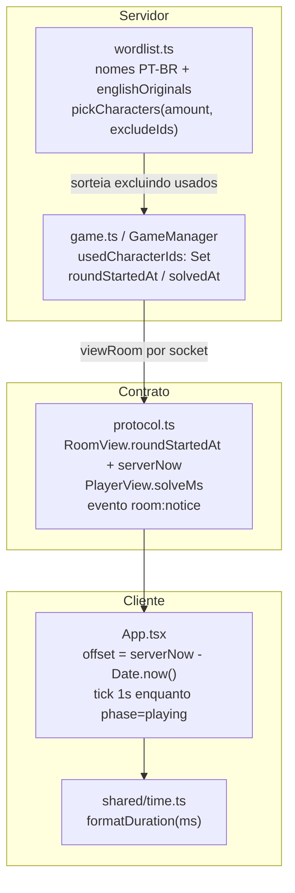

# Melhorias do Jogo — Design

**Spec**: `.specs/features/melhorias-jogo/spec.md`
**Status**: Draft

---

## Architecture Overview

Três mudanças independentes que compartilham dois arquivos (`server/game.ts`, `shared/protocol.ts`). Nenhuma introduz módulo novo no servidor: a wordlist ganha um mapa de originais, a sala ganha um `Set` de personagens usados e dois instantes, e o cliente ganha um relógio sincronizado. O único arquivo novo é `shared/time.ts`, para que a formatação de duração seja testável fora do React.



O cronômetro não gera tráfego novo: `roundStartedAt` e `serverNow` pegam carona nos `room:state` que já são emitidos. O cliente conta localmente entre payloads.

---

## Abordagens consideradas

### Sincronização de tempo (a decisão não óbvia)

| Abordagem | Como funciona | Erro | Custo |
| --------- | ------------- | ---- | ----- |
| **A. `roundStartedAt` + `serverNow` por payload** ✅ **recomendada** | Servidor manda os dois instantes; cliente calcula `offset = serverNow - Date.now()` e exibe `Date.now() + offset - roundStartedAt` | Latência de ida (dezenas de ms), não acumula | 8 bytes por payload |
| B. Servidor manda `elapsedMs` pronto | Cliente parte do valor recebido e incrementa localmente | Acumula o drift do relógio do cliente entre payloads | Igual |
| C. Cliente pede a hora ao servidor periodicamente | Handshake de tempo dedicado | Menor de todos | Evento novo + tráfego periódico |

Escolhida a **A**: erro que não acumula, sem evento novo, sem tráfego periódico, e o servidor continua a única fonte da verdade (AD-003). A **B** foi descartada porque o erro cresce quanto mais longa a rodada — exatamente o caso em que o cronômetro importa. A **C** resolve um problema de precisão que este jogo não tem.

### Representação da tradução

| Abordagem | Trade-off |
| --------- | --------- |
| **A. `characterSets` em PT-BR + `englishOriginals` como mapa exportado** ✅ **recomendada** | Uma fonte da verdade: o mapa alimenta os aliases **e** serve de oráculo para o teste do WORD-06. Mantém o formato de strings com `\|` que o arquivo já usa. |
| B. Dobrar os originais dentro do `aliasesByName` existente | Menos código novo, mas o teste do WORD-06 precisaria de uma lista de nomes em inglês duplicada dentro do teste — duas fontes da verdade que saem de sincronia. |
| C. Arquivo JSON de tradução carregado em runtime | I/O e parsing para um dado estático; nada no projeto lê JSON em runtime hoje. |

---

## Code Reuse Analysis

### Existing Components to Leverage

| Component | Location | How to Use |
| --------- | -------- | ---------- |
| `normalizeText()` | `server/normalization.ts:1` | Já remove acentos e caixa — atende WORD-04 sem código novo. Também é a chave dos mapas de alias. |
| `aliasesByName` | `server/wordlist.ts:44` | Padrão existente de alias por nome normalizado; `englishOriginals` segue a mesma forma e os dois são fundidos na montagem dos seeds. |
| `characterMatches()` | `server/wordlist.ts:144` | Compara nome + aliases normalizados. Nenhuma mudança: aceitar o inglês (WORD-02/03) sai de graça ao pôr o original nos aliases. |
| `uniqueSeeds` + guard `MIN_CURATED_CHARACTERS` | `server/wordlist.ts:111-131` | Já garante id/nome único e mínimo de 250 (WORD-05). Ver Risks: o dedupe é silencioso. |
| `viewRoom(room, viewerId)` | `server/game.ts:386` | Única porta de saída do estado por socket. `roundStartedAt`, `serverNow` e `solveMs` entram aqui e chegam a todas as telas sem mexer nos emissores. |
| `touch(room)` | `server/game.ts:524` | Já registra `updatedAt`; `roundStartedAt` é um campo irmão no mesmo `RoomState`. |
| `resetAfterDeparture()` / `playAgain()` | `server/game.ts:512` / `245` | Já zeram estado por rodada; ganham o reset de `roundStartedAt`/`solvedAt` e **não** tocam em `usedCharacterIds`. |
| `InlineNotice` | `src/App.tsx:401` | Componente de aviso já existente — reaproveitado para o aviso de reciclagem do catálogo (POOL-05). |

### Integration Points

| System | Integration Method |
| ------ | ------------------ |
| Socket.IO (`room:state`, `round:started`, `round:finished`) | Campos novos viajam dentro do `RoomView` que esses eventos já carregam; nenhum emissor muda de assinatura. |
| Novo evento `room:notice` | Adicionado a `ServerToClientEvents`; emitido para a sala inteira via `io.to(room.code)`, único caso da feature em que broadcast por sala é seguro (não carrega personagem). |
| `sessionStorage` | Não muda. Nenhum dado novo é persistido no cliente. |

---

## Components

### `shared/time.ts` (novo)

- **Purpose**: Formatar duração em milissegundos para exibição.
- **Location**: `shared/time.ts`
- **Interfaces**:
  - `formatDuration(ms: number): string` — `mm:ss` abaixo de 1h, `h:mm:ss` a partir de 1h (TIME-08); negativo ou `NaN` retorna `00:00`.
- **Dependencies**: nenhuma.
- **Reuses**: nada. Vive em `shared/` porque é o único diretório incluído nos dois tsconfigs, então o teste e o app importam o mesmo código.

### `server/wordlist.ts` (alterado)

- **Purpose**: Catálogo em PT-BR e sorteio com exclusão.
- **Interfaces**:
  - `pickCharacters(amount: number, excludeIds?: ReadonlySet<string>): Character[]` — parâmetro novo e opcional; sem ele o comportamento é o de hoje.
  - `englishOriginals: Record<string, string>` — nome PT-BR normalizado → nome original em inglês. Exportado para servir de oráculo ao teste do WORD-06.
- **Dependencies**: `normalizeText`.
- **Reuses**: `aliasesByName`, `uniqueSeeds`, guard de mínimo.

### `server/game.ts` — `GameManager` (alterado)

- **Purpose**: Guardar personagens usados por sala e os instantes da rodada.
- **Interfaces** (mudanças internas):
  - `RoomState.usedCharacterIds: Set<string>` — ids já atribuídos na sala.
  - `RoomState.roundStartedAt: number | null` — epoch ms; `null` fora de rodada.
  - `PlayerState.solvedAt: number | null` — epoch ms do acerto.
  - `startRound(room)` — calcula disponíveis, recicla e avisa se faltar, sorteia, marca usados, grava `roundStartedAt`.
  - `createGameManager(io, roomTtlMinutes?)` — segundo parâmetro passa a existir de fato (ver Risks).
- **Dependencies**: `pickCharacters`, `characters`.
- **Reuses**: `viewRoom`, `touch`, `broadcastRoomState`.

### `src/App.tsx` (alterado)

- **Purpose**: Exibir o cronômetro da rodada e a duração de cada acerto.
- **Interfaces**:
  - `useRoundClock(room): number | null` — hook local: guarda o offset do servidor, dispara um tick de 1s **somente** enquanto `phase === 'playing'`, devolve o elapsed em ms ou `null` fora de rodada.
  - `formatDuration` importado de `shared/time.ts`.
- **Reuses**: `InlineNotice`, `RoomHeader`, estrutura de `ranking-row` e `solve-meter`.

---

## Data Models

```typescript
// shared/protocol.ts — campos adicionados

interface PlayerView {
  // …campos atuais
  solveMs: number | null   // duração do acerto; null se ainda não acertou
}

interface RoomView {
  // …campos atuais
  roundStartedAt: number | null  // epoch ms do servidor; null em lobby
  serverNow: number              // epoch ms do servidor no instante do emit
}

interface PlayerSolvedPayload {
  playerId: string
  nickname: string
  rank: number
  solveMs: number                // novo
}

interface RoundFinishedPayload {
  room: RoomView
  ranking: Array<{
    playerId: string
    nickname: string
    rank: number | null
    solveMs: number | null       // novo
  }>
}

interface RoomNoticePayload {     // novo
  code: string                   // 'CATALOG_RECYCLED'
  message: string
}
```

**Relationships**: `solveMs` é derivado, não armazenado: `solvedAt - roundStartedAt`. Guardar os dois instantes e derivar na borda evita que um `playAgain` deixe uma duração órfã de uma rodada que não existe mais.

---

## Error Handling Strategy

| Error Scenario | Handling | User Impact |
| -------------- | -------- | ----------- |
| Personagens disponíveis < jogadores | `usedCharacterIds.clear()` antes do sorteio, depois `room:notice` com `CATALOG_RECYCLED` | Aviso na tela: "Os personagens deram a volta: o catálogo foi liberado de novo." A rodada começa normalmente. |
| Jogador reconecta no meio da rodada | `resumeFromHandshake` já reemite o estado; o `RoomView` traz `roundStartedAt` e `serverNow` e o cronômetro retoma no tempo certo (TIME-06) | Cronômetro correto, sem reiniciar de zero. |
| Rodada abortada por saída de jogador | `resetAfterDeparture` zera `roundStartedAt` e `solvedAt`, preserva `usedCharacterIds` | Cronômetro desaparece; volta ao lobby. |
| Jogador nunca acertou | `solveMs` fica `null` | Placar mostra `—` na coluna de tempo. |
| Relógio do cliente errado | Offset recalculado a cada payload de estado | Tempo do servidor, erro < 1s. |
| `formatDuration` recebe negativo/`NaN` | Retorna `00:00` | Nunca exibe `NaN:NaN`. |

---

## Risks & Concerns

| Concern | Location (file:line) | Impact | Mitigation |
| ------- | -------------------- | ------ | ---------- |
| `uniqueSeeds` deduplica por nome normalizado **em silêncio** — se duas traduções colidirem (ex.: dois personagens virando "Fera"), o catálogo encolhe sem erro | `server/wordlist.ts:111-117` | Perda silenciosa de personagens; o guard de 250 só pega se cair muito | T2 adiciona teste que compara `seeds.length` com `characters.length`; uma colisão de tradução passa a quebrar a suíte em vez de sumir |
| Teste existente fixa o nome literal `'Spider-Man'` | `tests/wordlist.test.ts:13` | Quebra assim que a tradução entra | T2 reescreve o teste para o par PT-BR/alias (`Homem-Aranha` + `Spider-Man`) |
| `createGameManager(io)` aceita 1 parâmetro, mas o teste de integração passa 2 — o TTL de 1 min é ignorado em silêncio; `tests/` não está em nenhum tsconfig, então o typecheck nunca vê | `server/game.ts:539`, `tests/game.integration.test.ts:64` | Erros de tipo em testes (inclusive nos novos) passam sem detecção | **Fora do escopo desta feature** — bug pré-existente, não pedido pelo usuário, e os testes novos não dependem de TTL controlado. Já reportado ao usuário; fica como follow-up proposto separadamente para não misturar correção alheia nos commits desta feature |
| Tick de 1s re-renderiza `App` durante a rodada | `src/App.tsx:18` | Re-render por segundo com input controlado (`value={guess}`) | Tick só existe enquanto `phase === 'playing'`; o `<input>` é o mesmo elemento entre renders, então React preserva foco e cursor |
| Nomes cujo original em inglês é também o nome brasileiro (`Batman`, `Goku`) não entram em `englishOriginals` | `server/wordlist.ts` | Se entrassem, o teste do WORD-06 falharia acusando "inglês exibido" num nome que é o correto em PT-BR | `englishOriginals` só registra pares em que a forma brasileira **difere** do original; é o que torna o teste do WORD-06 correto e não apenas restritivo |

---

## Tech Decisions (only non-obvious ones)

| Decision | Choice | Rationale |
| -------- | ------ | --------- |
| Onde mora a formatação de duração | `shared/time.ts` | Único diretório nos dois tsconfigs; permite testar TIME-08 sem montar React |
| `solveMs` derivado vs armazenado | Armazenar `solvedAt`, derivar `solveMs` em `viewRoom` | Um `playAgain` que zere `roundStartedAt` não pode deixar duração órfã |
| Aviso de reciclagem: evento novo vs `error` | Evento novo `room:notice` | Reciclar não é erro; usar `error` acionaria o tratamento de falha do cliente (`src/App.tsx:77`) e poderia limpar a sessão |
| Escopo do cronômetro | Só rodada + acerto, sem tempo total de sala | Tempo total foi oferecido ao usuário e recusado (feature-local, não vai para STATE) |
| `excludeIds` opcional em `pickCharacters` | Parâmetro opcional | Mantém a assinatura atual válida e o teste `wordlist.test.ts` existente compilando |

> Decisões de nível de projeto desta feature foram registradas em `.specs/STATE.md`: **AD-001** (regra de tradução), **AD-002** (pool por sala), **AD-003** (tempo do servidor).
